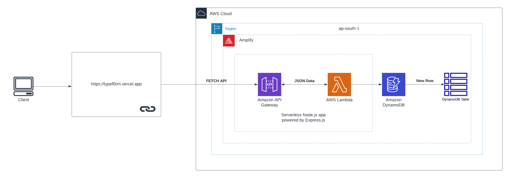

<a href="https://nextf0rm.vercel.app/">
  
  <h1 align="center">Next.js Forms</h1>
</a>

<p align="center">
  An open-source web-form app built with Next.js<br>
  Express.js and AWS for the REST API and NoSQL database.
</p>

<p align="center">
  <a href="#features"><strong>Features</strong></a> ·
  <a href="#running-locally"><strong>Running locally</strong></a> ·
  <a href="#overview"><strong>Overview</strong></a> ·
  <a href="#api-routing"><strong>API Routing</strong></a> ·
  <a href="#authors"><strong>Authors</strong></a>
</p>
<br/>

## Features

- [Next.js](https://nextjs.org) App Router
- [Amazon Web Services](https://docs.aws.amazon.com/) for backend functionality
- The [Amplify Framework](https://docs.amplify.aws/) for AWS integration
- Support for `REST API`, NoSQL Database `DynamoDB`, and `Lambda` functions
- Edge runtime-ready
- [shadcn/ui](https://ui.shadcn.com)
  - Styling with [Tailwind CSS](https://tailwindcss.com)
  - [Radix UI](https://radix-ui.com) for headless component primitives
- [Cross Origin Resource Sharing ](https://aws.amazon.com/what-is/cross-origin-resource-sharing) for legitimate requests only
- [Zod](https://zod.dev) Typesafe Form Validation ensuring sanitized input is always sent

## Overview


A static site is hosted with a contact form. We use `API Gateway` to create an API which makes a `PUT` request to our `DynamoDB` database after the user clicks <kbd>Register</kbd> on the form.

The API sends user records to `DynamoDB` which then pushes the record into the `DynamoDB Data Stream`.

## Running locally

First, run the development server:

```bash
npm install
npm run dev
```

Your app template should now be running on [localhost:3000](http://localhost:3000/).

## API Routing

The `REST API` is hosted on AWS using a Lambda function which deploys a `Serverless Express.js app`. Source code for lambda function is in the [`amplify/backend/function/formfunction/src/app.js`](./amplify/backend/function/formfunction/src/app.js)

> [!IMPORTANT]  
> The app template which is running on [localhost:3000](http://localhost:3000/) is using the `REST API` hosted on AWS. It has CORS enabled which means your app template will not be able make requests to the `REST API` hosted on AWS. 

> [!NOTE]
> To learn more about the `Serverless Express.js app` and how to deploy it, visit the [`amplify/README.md`](./amplify/README.md) 

## Authors

This project is created by [MLSA KIIT](https://mlsakiit.com) team members:

- Sourasish Basu ([@SourasishBasu](https://github.com/jaredpalmer)) - [MLSA KIIT](https://mlsakiit.com)
- Swapnil Dutta ([@rycerzes](https://github.com/shuding_)) - [MLSA KIIT](https://mlsakiit.com)
- 
## Version
| Version | Date          		| Comments        |
| ------- | ------------------- | --------------- |
| 1.0     | Nov 21th, 2023   | Initial release |

## Future Roadmap
- [ ] Authentication and Authorization using API Keys
- [ ] HTTPS Validation
- [ ] Input Validation and Sanitization on server side
- [ ] Better Error Handling