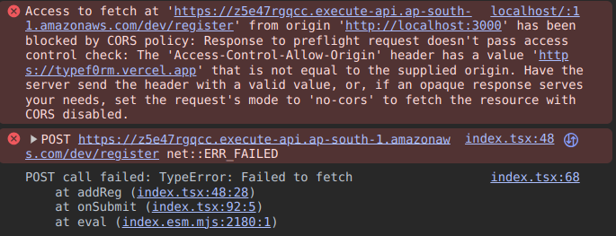
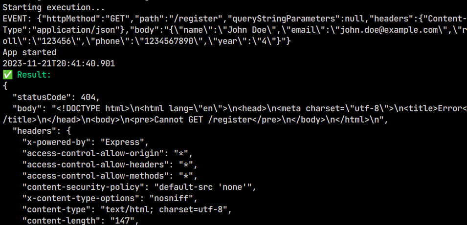

# Getting Started with `REST API`
Initial commit to this directory was generated by [Amplify CLI](https://docs.amplify.aws/cli) using `amplify init` followed by `amplify add storage` and `amplify add api` commands.

### Features
- `REST` API with editable endpoints
- `Serverless Express.js` App with `AWS Lambda` & `Amazon API Gateway` for management
- connects to a table in `DynamoDB` with configurable parameters
- sends a `POST` request to the URL using the `fetch API`.
The request includes headers specifying the content type as `application/json`, and the body of the request is the stringified version of the data argument.

### Authentication
The authentication of the `POST` request is handled by **AWS API Gateway**. It uses the CORS method to check if the `POST` request is sent by the site listed in its **Access-Control-Allow-Origin** header.

```javascript
// Enable CORS for all methods
app.use(function(req, res, next) {
  res.header("Access-Control-Allow-Origin", "*")
  res.header("Access-Control-Allow-Headers", "*")
  res.header("Access-Control-Allow-Methods", "*") 
  next()
});
```
The above [`app.js`](https://github.com/rycerzes/nextform/blob/main/amplify/backend/function/formfunction/src/app.js) shows that the Access-Control-Allow headers have the `Origin`, `Headers` and `Methods` parameters as `*` (wildcard) which means the API will accept all POST requests. 

> This default behavior is overwritten with CORS from AWS API Gateway which in our case, specifies the Access-Control-Allow-Origin as [https://nextf0rm.vercel.app](https://nextf0rm.vercel.app) 

> The overwritten CORS rule disables any other origin thus preventing cross-domain exploits.


This image shows that the `POST` request was sent from a different origin than the one specified in the Access-Control-Allow-Origin header.

### Endpoints
The resource for this API is [https://z5e47rgqcc.execute-api.ap-south-1.amazonaws.com/dev](https://z5e47rgqcc.execute-api.ap-south-1.amazonaws.com/dev/register) with the following path `/register`

The following script shows that [app.js](./backend/function/formfunction/src/app.js) only has a POST method route with params mentioned in `Item`

```javascript
app.post('/register', function(req, res) {
  const params = {
    TableName: process.env.STORAGE_FORMTABLE_NAME,
    Item: {
      id: id(),
      name: req.body.name,
      email: req.body.email,
      roll: req.body.roll,
      phone: req.body.phone,
      year: req.body.year,
      onCreated: time() 
    }
  }
  docClient.put(params, function(err, data) {
    if (err) res.json({ err })
    else res.json({ success: 'Form successfully submitted' })
  })
});
```
### Error Codes 5XX & 4XX
* 5XX (Server Error): The server failed to fulfill an apparently valid request
* 4XX (Client Error): The request contains bad syntax or cannot be fulfilled

> Express comes with a default error handler which is used so every status code is default



404 Error code caused due invalid `httpMethod` **GET**

### Example Requests
```json
{
  "httpMethod": "POST",
  "path": "/register",
  "queryStringParameters": null,
  "headers": {
    "Content-Type": "application/json"
  },
  "body": "{\"name\":\"John Doe\",\"email\":\"john.doe@example.com\",\"roll\":\"123456\",\"phone\":\"1234567890\",\"year\":\"4\"}"
}
```
The event.json file above is used to test the function locally using the following command
```bash
amplify mock function 
? Provide the path to the event JSON object relative to nextform/amplify/backend/function/formfunction 
‣ src/event.json 
```
The output to the above command should be:
```bash
Ensuring latest function changes are built...
Starting execution...
EVENT: {"httpMethod":"POST","path":"/register","queryStringParameters":null,"headers":{"Content-Type":"application/json"},"body":"{\"name\":\"John Doe\",\"email\":\"john.doe@example.com\",\"roll\":\"123456\",\"phone\":\"1234567890\",\"year\":\"4\"}"}
App started
2023-11-21T18:47:01.630
✅ Result:
{
  "statusCode": 200,
  "body": "{\"success\":\"Form successfully submitted\"}",
  "headers": {
    "x-powered-by": "Express",
    "access-control-allow-origin": "*",
    "access-control-allow-headers": "*",
    "access-control-allow-methods": "*",
    "content-type": "application/json; charset=utf-8",
    "content-length": "41",
    "etag": "W/\"29-/Z6Mq72ClZ+OiUoUSSCD9zSw+gg\"",
    "date": "Tue, 21 Nov 2023 13:17:01 GMT",
    "connection": "close"
  },
  "isBase64Encoded": false
}
Finished execution.
```

## Resources:
- Amplify documentation: https://docs.amplify.aws
- Amplify CLI documentation: https://docs.amplify.aws/cli
- More details on this folder & generated files: https://docs.amplify.aws/cli/reference/files
- Join Amplify's community: https://amplify.aws/community/
- Express.js App: https://docs.amplify.aws/cli/usage/express
- DynamoDB: https://docs.amplify.aws/cli/usage/dynamodb
- Serverless: https://www.serverless.com/framework/docs